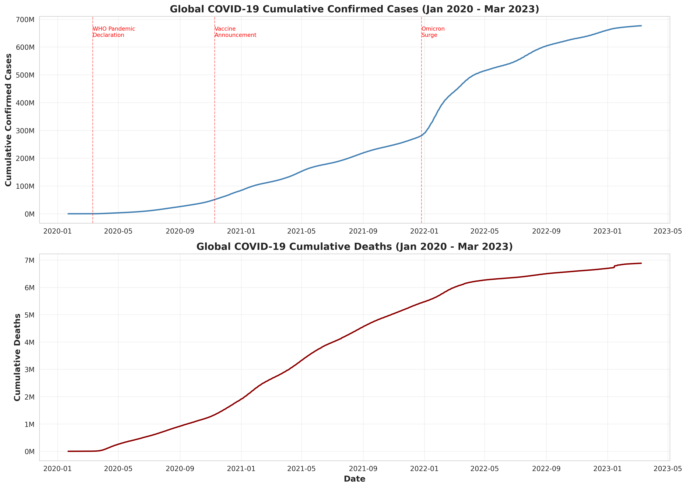
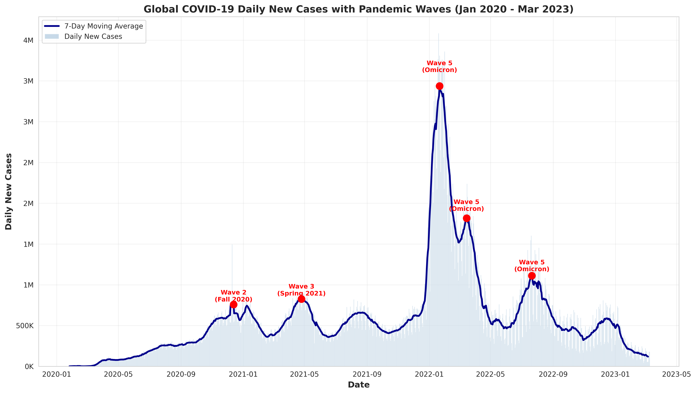
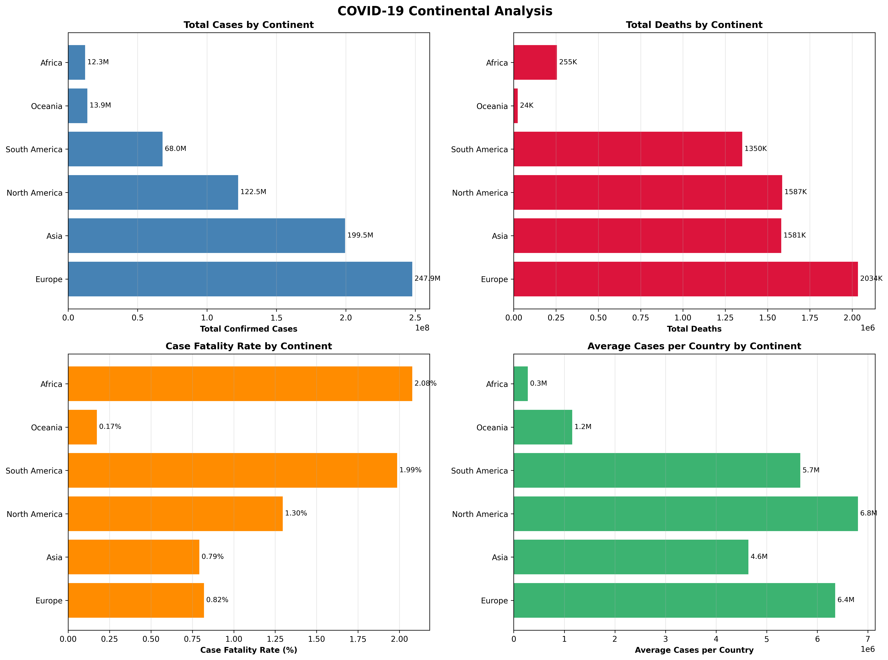
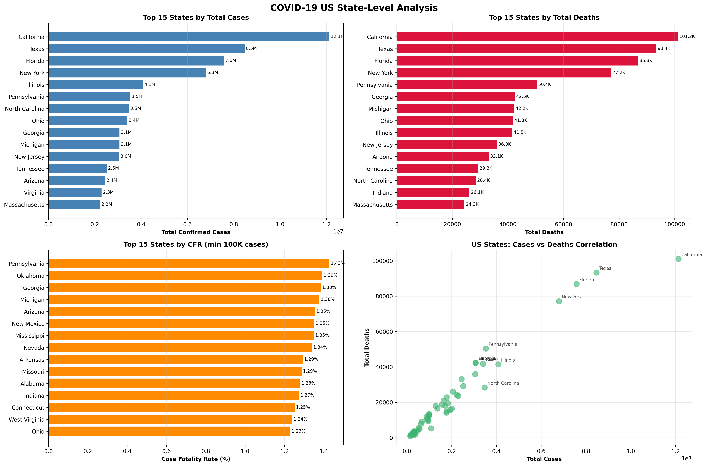
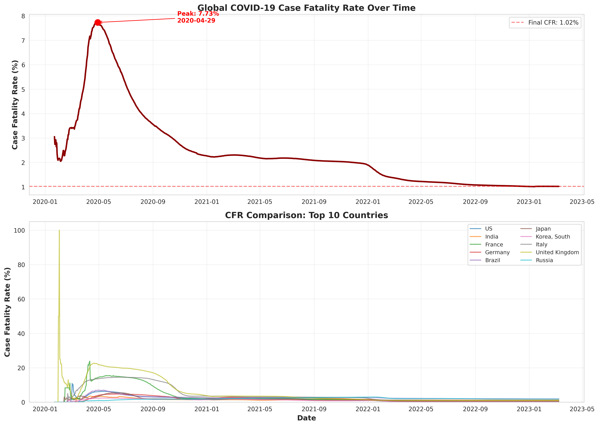

# COVID-19 Exploratory Data Analysis

This example demonstrates Gyoshu's autonomous research capabilities using the JHU CSSE COVID-19 dataset.

## What This Example Shows

- **Automatic data download** from Kaggle
- **Comprehensive EDA** with statistical analysis
- **Multi-dimensional visualization** (temporal, geographic, comparative)
- **Structured output markers** for reproducibility
- **Automatic figure generation** saved to reports directory

## The Prompt Used

```bash
/gyoshu-auto Download kaggle COVID-19 Novel Coronavirus dataset, perform comprehensive EDA, build valuable prediction/classification models, and derive actionable insights for future pandemic preparedness
```

See [prompt.md](prompt.md) for the exact command.

## Results

### Key Findings

1. **Temporal Patterns**: Multiple distinct pandemic waves identified across different regions
2. **Geographic Variation**: Significant differences in case fatality rates by continent
3. **US State Analysis**: Large variation in per-capita impact across states
4. **Wave Dynamics**: Daily new case patterns reveal clear epidemic waves

### Generated Figures

| Figure | Description |
|--------|-------------|
|  | Cumulative confirmed cases and deaths over time |
|  | Daily new cases showing pandemic waves |
|  | Comparison across continents |
|  | Per-capita analysis of US states |
|  | Case fatality rate trends |

## Running This Example

### Prerequisites

1. **Kaggle API credentials**: Set up `~/.kaggle/kaggle.json`
   ```bash
   # Get your API token from https://www.kaggle.com/settings
   mkdir -p ~/.kaggle
   echo '{"username":"YOUR_USERNAME","key":"YOUR_KEY"}' > ~/.kaggle/kaggle.json
   chmod 600 ~/.kaggle/kaggle.json
   ```

2. **Python environment** with pandas, matplotlib, seaborn

### Run with Gyoshu

```bash
# Navigate to an empty directory
mkdir covid-analysis && cd covid-analysis

# Initialize Python environment
python3 -m venv .venv
source .venv/bin/activate
pip install pandas numpy matplotlib seaborn kaggle

# Run the autonomous research
/gyoshu-auto Download kaggle COVID-19 Novel Coronavirus dataset, perform comprehensive EDA
```

### Expected Output

- `notebooks/` - Jupyter notebook with all code and outputs
- `reports/` - Generated figures and analysis summaries
- `data/` - Downloaded CSV files (not included in this example)

## Dataset

**Source**: [JHU CSSE COVID-19 Dataset on Kaggle](https://www.kaggle.com/datasets/sudalairajkumar/novel-corona-virus-2019-dataset)

**Files used**:
- `time_series_covid19_confirmed_global.csv`
- `time_series_covid19_deaths_global.csv`
- `time_series_covid19_confirmed_US.csv`
- `time_series_covid19_deaths_US.csv`

> **Note**: Raw data files are not included in this repository due to size. They will be downloaded automatically when you run the example.

## Notebook Structure

The notebook (`notebook.ipynb`) contains:

1. **Data Download** (Stage S01) - Kaggle API integration
2. **Data Loading** (Stage S02) - Read and validate CSVs
3. **Initial EDA** (Stage S03) - Basic statistics and shape
4. **Temporal Analysis** (Stage S04) - Time series patterns
5. **Geographic Analysis** (Stage S05) - Country/region comparisons
6. **US State Analysis** (Stage S06) - State-level deep dive
7. **Conclusions** - Key findings and insights

## Execution Time

- **Total runtime**: ~45 minutes
- **Cycles used**: 10 (autonomous budget)

## Learn More

- [Gyoshu Documentation](../../README.md)
- [Gyoshu Slash Commands](../../AGENTS.md#slash-commands)
